  <a href="https://home.adamllll.com/projects" aria-label="Open Adam's projects"><strong>PROJECTS.EXE</strong></a>
  &nbsp;/&nbsp;
  <a href="https://home.adamllll.com/blog" aria-label="Open Adam's blog"><strong>BLOG.DB</strong></a>
  &nbsp;/&nbsp;
  <a href="https://home.adamllll.com/about" aria-label="Open Adam's about page"><strong>ABOUT.SYS</strong></a>

