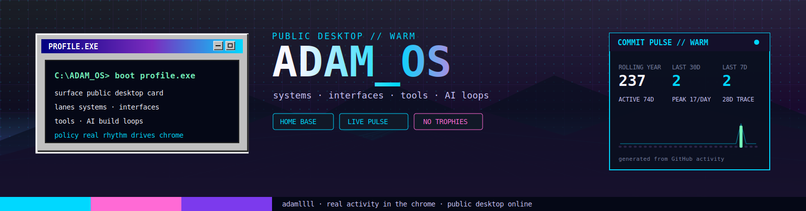

<div align="center">



<br />

<a href="https://home.adamllll.com"></a>
<a href="https://home.adamllll.com/blog"></a>
<a href="https://github.com/adamllll?tab=repositories"></a>

</div>

```text
C:\ADAM_OS> boot profile.exe
surface  GitHub profile as a public desktop card
focus    systems · interfaces · tools · AI-assisted build loops
rule     signal over scoreboard; native calendar over fake graphs
```

## `~/console`

| lane | signal |
|---|---|
| **Systems** | backend experiments, state flow, runtime edges |
| **Interfaces** | TypeScript surfaces, retro UI, narrative entry points |
| **Tools** | small useful machines, automation, observability |
| **Workflow** | AI-assisted loops, docs, tests, release verification |

## `~/active-window`

```bash
adam@github:~$ current --shape
building personal OS surfaces, deployment tools, and small public artifacts

adam@github:~$ preference --ui
retro terminal atmosphere, readable hierarchy, fewer fake trophy counters

adam@github:~$ constraint --github-profile
GitHub-compatible markdown only; local SVG art; contribution truth from native calendar
```

## `system-monitor://native-calendar`

<div align="center">


<br />


</div>

```text
C:\ADAM_OS\SIGNALS> inspect graph-source
source     GitHub native contribution calendar on this profile page
scope      commits / PRs / reviews / issues; private when enabled
policy     no third-party activity graphs in this README
action     scroll down to the green contribution grid
```

<details>
<summary><b>中文说明</b></summary>

这是我的 GitHub 入口，不是奖杯墙。

贡献记录以本页下方 **GitHub 原生贡献日历** 为准。  
README 里嵌不进官方原生日历控件，所以这里不再放第三方公开活动图。

私有仓库提交要在 GitHub 设置里开启  
`Contribution settings -> Private contributions` 后，才会匿名计入原生日历。

完整一点的版本在个人主页里，更像一台可以点开的旧电脑。

</details>

---

<div align="center">

<sub>front poster online / native calendar below / full home base behind the door</sub>

<br />
<br />


</div>
