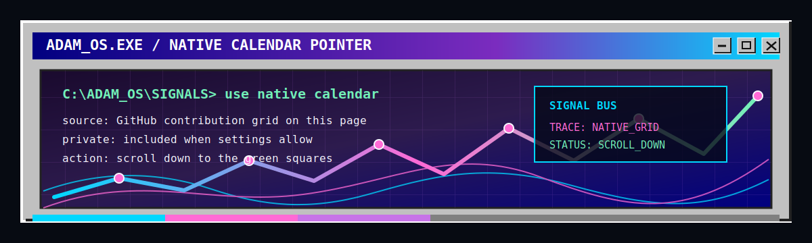

<div align="center">


```text
C:\ADAM_OS> boot profile.exe
surface: GitHub profile as public desktop
signal:  commit trace over trophy board
style:   Win95 chrome, vaporwave phosphor
```

<a href="https://home.adamllll.com"></a> <a href="https://github.com/adamllll"></a> <a href="https://home.adamllll.com/blog"></a>

</div>

---

## `~/profile`

```bash
adam@github:~$ whoami
systems / tools / interfaces / AI-assisted build loops

adam@github:~$ boot --surface
GitHub profile -> public desktop card -> commit signal monitor

adam@github:~$ current --shape
small useful machines, retro surfaces, narrative entry points
```

## `~/signal`

<p align="center">
  
  
  
  
  
</p>

```text
SYSTEMS      backend experiments, state flow, runtime edges
INTERFACES   TypeScript surfaces, retro UI, narrative entry points
WORKFLOW     AI-assisted loops, docs, experiments, verification
```

## `system-monitor://commit-trace`

<div align="center">



<br />
<br />


<br />
<br />


<br />
<br />


</div>

```text
C:\ADAM_OS\SIGNALS> inspect commit-trace

input      public GitHub activity
scope      commits, pull requests, reviews, issues, commit hours
readout    rhythm, pressure, shipping pulse, active windows
filter     trophy numbers muted

C:\ADAM_OS\SIGNALS> render graph --vaporwave --win95-frame
```

```text
+----------------------------------------------------------------+
| ADAM_OS MONITOR                              SIGNAL: PUBLIC     |
+----------------------------------------------------------------+
| cyan trace     public contribution intensity                    |
| pink nodes     active days on the graph                         |
| violet field   activity area, not a trophy counter              |
+----------------------------------------------------------------+
```

<details>
<summary><b>中文说明</b></summary>

这是我的 GitHub 入口。重点不是数字好看，而是公开提交节奏和正在折腾的系统痕迹。

完整一点的版本在我的个人主页里。那里更像一台可以点开的旧电脑。

</details>

---

<div align="center">

<sub>front poster online / bridge to the full home base</sub>

<br />
<br />


</div>

<!--
Banner asset prompt for the future self-hosted image:

A retro Windows 95 vaporwave desktop banner background, 16:5 wide composition, deep purple night sky, neon cyan and magenta glow, low-poly horizon mountains, chrome grid floor receding into perspective, subtle CRT scanline texture, pixel-art inspired but polished, empty center space for title text, small abstract desktop window silhouettes near the edges, nostalgic 1990s computer interface mood, high contrast, crisp details, no readable text, no logos, no watermark.

Recommended final asset path: assets/profile-banner.png
Recommended final size: 1600x520
-->
